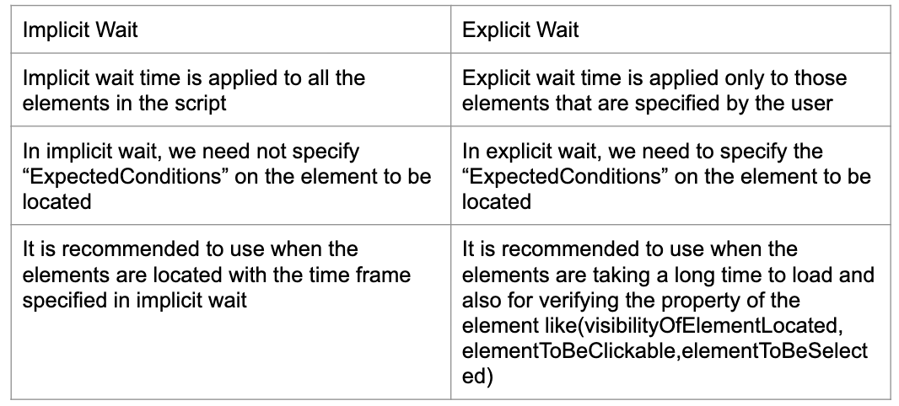

#Writing Resilient Test Code

<h2>So far...</h2>

Ideally, you should be able to write your tests once and run them across all supported browsers. While this is a rosy proposition, there is some work to make this a reliable success.

By using high quality locators we're already in good shape, but there are still some issues to deal with. Most notably... timing. This is especially true when working with dynamic, JavaScript heavy pages.

<h2>An Explicit Waits Primer</h2>

Explicit waits are applied to individual test actions. Each time you want to use one you specify an amount of time (in seconds) and the Selenium action action you want to accomplish.
Selenium will repeatedly try this action until either it can be accomplished, or the amount of time specified has been reached. If the latter occurs, a timeout exception will be thrown.

<h2>An Example</h2>
Let's step through an example that demonstrates this against a dynamic page on the-internet. 

This is the page :)
http://the-internet.herokuapp.com/dynamic_loading/1

The functionality is pretty simple -- there is a button. When you click it a loading bar appears for 5 seconds, after which it disappears and is replaced with the text **Hello World!**.

<h2>Implicit vs Explicit Waits</h2>

