# Chapter 02 - An Overview of Java


<h1>What Is Java?</h1>
<div style="text-align: justify">

Java is a programming language and computing platform first released by Sun Microsystems in 1995. The language was initially called _Oak_ but later the project was finally named _Java_, from Java Coffee, the Indonesian coffee.

There are lots of applications and websites that will not work unless you have Java installed.
Java applications are called WORA (Write Once Run Anywhere). This means a programmer can develop Java code on one system and can expect it to run on any other Java-enabled system without any adjustment. This is all possible because of the **Java Virtual Machine** 
(JVM).

The JVM is a program whose purpose is to execute other programs and it has two primary functions: to allow Java programs to run on any device or operating system, and to manage and optimize program memory

</div>

<h1>How Does Java Work?</h1>

<div style="text-align: justify">

When a Java application is executed using an Integration Development Environment (IDE), after writing the code, the only necessary action to run the program is to press the IDE play button. But what is happening behind the scenes is the following:

<p align="center">
    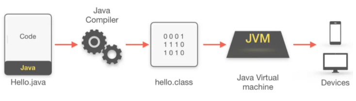
</p>

1. **Writing the source code**: The source code is needed first, in this case it will be a file which contain all the java code. The extension of such file must be **.java**
2. **Compiling the source code**: After writing the code, the java compiler will be executed to verify that every single line has been written without errors. If everything is correct, a file with extension **.class** will be generated. Such file contains the source code translated to a bytecode language
3. **Executing the program**: Finally, the JVM will read the **.class** file and based on the platform where the application is being executed, the bytecode will be translated to machine language that can be executed on the device.

</div>

<h1>Major Features of Java</h1>
<div style="text-align: justify">

- **Simple**: Java was designed to be easy for the professional programmer to learn and use effectively.
- **Secure**: in java can be created applications called applets. An applet is a Java program that runs in a Web browser. In order for Java to enable applets to be downloaded and executed on the client computer safely, it was necessary to prevent an applet from launching an attack to local machine resources.
- **Portable**: Java is portable because it facilitates you to carry the Java bytecode to any platform. 
- **Object Oriented**: Java manages to strike a balance between the purist’s “everything is an object” paradigm and the pragmatist’s “stay out of my way” model. The object model in Java is simple and easy to extend, while primitive types, such as integers, are kept as high-performance nonobjects.
- **Robust**: robust simply means strong. Java is robust because:
    - It uses strong memory management.
    - There is a lack of pointers that avoids security problems.
    - There are exception handling and the type checking mechanism in Java. All these points make Java robust.
- **Multithreaded**: Java supports multithreaded programming, which allows you to write programs that do many things simultaneously. 
- **Architecture-Neutral**: Java compiler generates an architecture-neutral object file format, which makes the compiled code executable on many processors with the presence of Java runtime system.
- **Interpreted and High Performance**: the Java bytecode was carefully designed so that it would be easy to translate directly into native machine code for very high performance by using a just-in-time compiler.
- **Distributed**: Java is designed for the distributed environment of the Internet because it handles TCP/IP protocols. In fact, accessing a resource using a URL is not much different from accessing a file. Java also supports Remote Method Invocation (RMI). This feature enables a program to invoke methods across a network.
- **Dynamic**: Java programs carry with them substantial amounts of run-time type information that is used to verify and resolve accesses to objects at run time.

</div>


<h1>Object Oriented Programming</h1>

<div style="text-align: justify">

Object-oriented programming (OOP) is at the core of Java. In fact, all Java programs are to at least some extent object-oriented. OOP is so integral to Java that it is best to understand its basic principles before you begin writing even simple Java programs. 

<h2>Two Paradigms</h2>

All computer programs consist of two elements: code and data. There are two paradigms that govern how a program is constructed. The first way is called the _process-oriented model_. This approach characterizes a program as a series of linear steps (that is, code). The _process-oriented model_ can be thought of as _code acting on data_, problems with this approach appear as programs grow larger and more complex.

To manage increasing complexity, the second approach, called **object-oriented programming**, was conceived. Object-oriented programming organizes a program around its data (that is, objects) and a set of well-defined interfaces to that data. An object-oriented program can be characterized as data controlling access to code.

<h2>Abstraction</h2>

An essential element of object-oriented programming is abstraction. Humans manage complexity through abstraction. For example, people do not think of a car as a set of tens of thousands of individual parts. They think of it as a well-defined object with its own unique behavior.

<p align="center">
    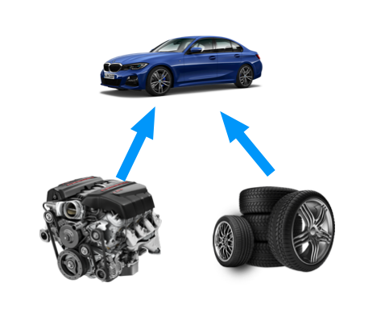
</p>

- Program data can be transformed into its component object by abstraction
- Objects are concrete entities that respond messages telling them to “do something”

<h2>The Three OOP Principles</h2>

<h3>Encapsulation</h3>

_Encapsulation_ is the mechanism that binds together code and the data it manipulates, and keeps both safe from outside interference and misuse. One way to think about encapsulation is as a protective wrapper that prevents the code and data from being arbitrarily accessed by other code defined outside the wrapper.

In Java, the basis of encapsulation is the **class**. A class defines the structure and behavior (data and code) that will be shared by a set of objects. Each object of a given class contains the structure and behavior defined by the class. For this reason, objects are sometimes referred to as _instances of a class_.

When you create a class, you will specify the code and data that constitute that class. Specifically, the data defined by the class are referred to as _member variables_ or _instance variables_. The code that operates on that data is referred to as _member methods_ or just _methods_.

Each method or variable in a class may be marked _private_ or _public_. The _public_ interface of a class represents everything that external users of the class need to know, or may know. The _private_ methods and data can only be accessed by code that is a member of the class.

<p align="center">
    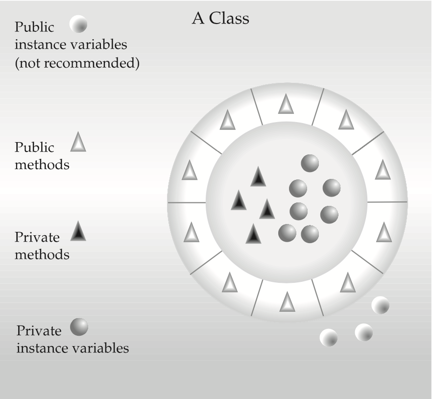
</p>

<h3>Inheritance</h3>

_Inheritance_ is the process by which one object acquires the properties of another object. This is important because it supports the concept of hierarchical classification. For example, a Golden Retriever is part of the classification dog, which in turn is part of the mammal class, which is under the larger class animal. Without the use of hierarchies, each object would need to define all of its characteristics explicitly. However, by use of inheritance, an object need only define those qualities that make it unique within its class. It can inherit its general attributes from its parent. The class dog is known as a _subclass_ of animals, where animals are referred to as dog's _superclass_.

<p align="center">
    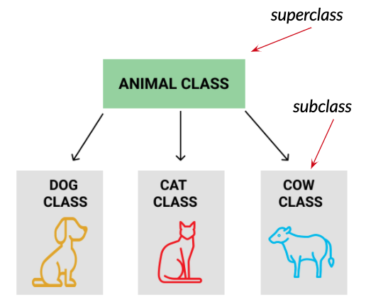
</p>

Inheritance interacts with encapsulation as well. If a given class encapsulates some attributes, then any subclass will have the same attributes plus any that it adds as part of its specialization. A new subclass inherits all of the attributes of all of its ancestors.

<p align="center">
    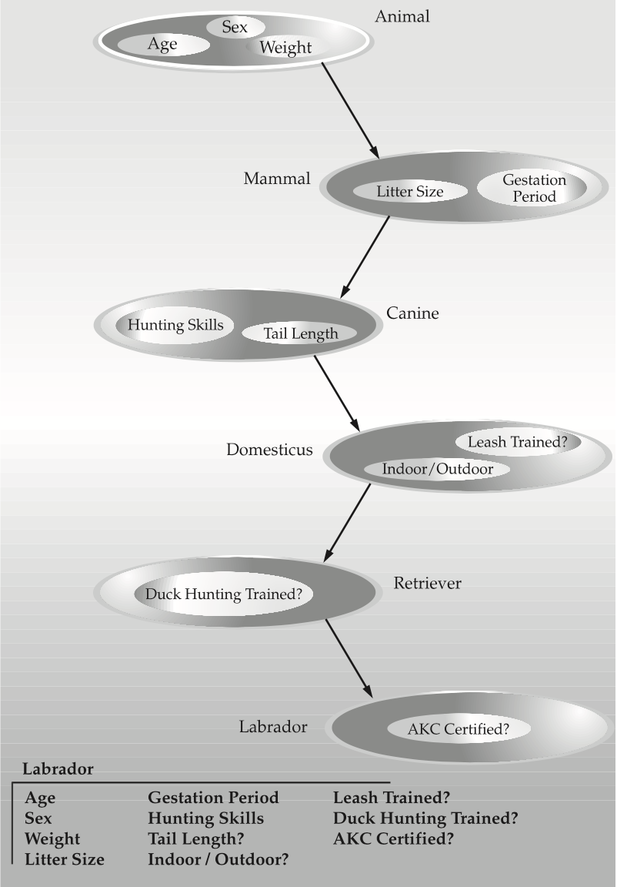
</p>

<h3>Polymorphism</h3>

_Polymorphism_ (from Greek, meaning “many forms”) is a feature that allows one interface to be used for a general class of actions. More generally, the concept of polymorphism is often expressed by the phrase “one interface, multiple methods.” This means that it is possible to design a generic interface to a group of related activities. This helps reduce complexity by allowing the same interface to be used to specify a general class of action.

In java the are many ways to use the polymorphism, one of them is that an object can take many forms, and another one is that exists many forms to do the same thing. For example, consider a Transport interface and three derived subclasses of it: Horse, Car and Airplane. Every transport media will implement the action of driving but the way to drive will be different on each case. Another important feature is since a Horse implement the Transport interface, it can be threated as a Transport object or as a Horse object.

<p align="center">
    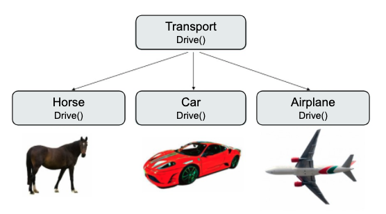
</p>

</div>

<h1>A First Simple Program</h1>

```java
/*
  This is a simple java program.
  Call this file "Example.java".
*/

class Example {
   // Your program begins with a call to main().
   public static void main(String args[]) {
       System.out.println("Hello World!");
   }
}
```

<div style="text-align: justify">

<h2>Entering the program</h2>

- The first thing that you must learn about Java is that the name you give to a source file is very important. For this example, the name of the source file should be **Example.java**.
- In Java, all code must reside inside a class. By convention, the name of the main class should match the name of the file that holds the program. You should also make sure that the capitalization of the filename matches the class name. The reason for this is that Java is case-sensitive.

<h2>Compiling the Program</h2>

To compile the Example program, execute the compiler **javac**, specifying the name of the source file on the command line, as shown here:

        C:\>javac Example.java

The javac compiler creates a file called **Example.class** that contains the bytecode version of the program. The Java bytecode is the intermediate representation of your program that contains instructions the Java Virtual Machine will execute.

To actually run the program, you must use the Java application launcher called java. To do so, pass the class name Example as a command-line argument, as shown here:

        C:\>java Example

When the program is run, the following output is displayed:

        Hello World!

<h2>A Closer Look at the First Sample Program</h2>

1. The program begins with the following lines:

        /*
        This is a simple Java program. Call this file "Example.java".
        */

    This is a _comment_. The contents of a comment are ignored by the compiler.

    Java supports three styles of comments. The one shown at the top of the program is called a multiline comment. This type of comment must begin with /* and end with */.

2. The next line of code in the program is shown here:

        class Example {

    This line uses the keyword **class** to declare that a new class is being defined. **Example** is an identifier that is the name of the class. The entire class definition, including all of its members, will be between the opening curly brace ({) and the closing curly brace (})

3. The next line in the program is the single-line comment, shown here: 

        // Your program begins with a call to main().

    This is the second type of comment supported by Java. A single-line comment begins with a // and ends at the end of the line.

4. The next line of code is shown here:

        public static void main(String args[ ]) {

    - This line begins the **main( )** method. This is the line at which the program will begin executing. Keep in mind that Java is case-sensitive. Thus, **Main** is different from **main**. It is important to understand that the Java compiler will compile classes that do not contain a **main( )** method. But java has no way to run these classes.
    - The **public** keyword is an access modifier, which allows the programmer to control the visibility of class members. In this case, **main( )** must be declared as public, since it must be called by code outside of its class when the program is started. 
    - The keyword **static** allows **main( )** to be called without having to instantiate a particular instance of the class. This is necessary since **main( )** is called by the Java Virtual Machine before any objects are made. 
    - The keyword **void** simply tells the compiler that **main( )** does not return a value.
    - Any information that you need to pass to a method is received by variables specified within the set of parentheses that follow the name of the method. These variables are called _parameters_.
    - If there are no parameters required for a given method, you still need to include the empty parentheses. In **main( )**, there is only one parameter. String args[ ] declares a parameter named args, which is an array of instances of the class String. Objects of type String store character strings. In this case, args receives any command-line arguments present when the program is executed.
    - The last character on the line is the {. This signals the start of **main( )**’s body.

5. The next line of code is shown here. Notice that it occurs inside **main( )**.

        System.out.println("Hello World!");

    - This line outputs the string "Hello World!" followed by a new line on the screen. Output is actually accomplished by the built-in **println( )** method. In this case, **println( )** displays the string which is passed to it. The line begins with **System.out**. **System** is a predefined class that provides access to the system, and **out** is the output stream that is connected to the console.
    - Notice that the **println( )** statement ends with a semicolon. All statements in Java end with a semicolon. 

6. The first } in the program ends **main( )**, and the last } ends the **Example** class definition.

</div>

<h1>A Second Short Program</h1>

<div style="text-align: justify">

As you may know, a variable is a named memory location that may be assigned a value by your program. The next program shows how a variable is declared and how it is assigned a value.

```java
/*
Here is another short example.
Call this file "Example2.java".
*/
class Example2 {
   public static void main(String args[]) {
       int num; // this declares a variable called num
       num = 100; // this assigns num the value 100
       System.out.println("This is num: " + num);
       num = num * 2;
       System.out.print("The value of num * 2 is ");
       System.out.println(num);
   }
}
```
When you run this program, you will see the following output:

    This is num: 100
    The value of num * 2 is 200

1. Let’s take a close look at why this output is generated. The first new line in the program is shown here:

        int num; // this declares a variable called num

    This line declares an integer variable called num. Java requires that variables be declared before they are used. Following is the general form of a variable declaration:

    >_type var-name;_

    Here, _type_ specifies the type of variable being declared, and _var-name_ is the name of the variable. If you want to declare more than one variable of the specified type, you may use a comma-separated list of variable names. Java defines several data types, including integer, character, and floating-point. The keyword **int** specifies an integer type.

2. In the program, the line

        num = 100; // this assigns num the value 100

    assigns to **num** the value 100. In Java, the assignment operator is a single equal sign.

3. The next line of code outputs the value of num preceded by the string "This is num:".

        System.out.println("This is num: " + num);
    
    In this statement, the plus sign causes the value of **num** to be appended to the string that precedes it, and then the resulting string is output.

4. The next line of code assigns **num** the value of **num** times 2. Like most other languages, Java uses the * operator to indicate multiplication. After this line executes, num will contain the value 200.

5. Here are the next two lines in the program:

        System.out.print ("The value of num * 2 is "); 
        System.out.println (num);

    Several new things are occurring here. First, the built-in method **print( )** is used to display the string "The value of num * 2 is ". This string is not followed by a newline. This means that when the next output is generated, it will start on the same line. The **print( )** method is just like **println( )**, except that it does not output a newline character after each call. Now look at the call to **println( )**. Notice that num is used by itself. Both **print( )** and **println( )** can be used to output values of any of Java’s built-in types.

</div>

<h1>Two Control Statements</h1>

<div style="text-align: justify">

<h2>The If Statement</h2>

The Java if statement works much like the **if** statement in any other language. Its simplest form is shown here:

```java    
if(condition) { 
    statement;     
}
```

Here, _condition_ is a Boolean expression. If _condition_ is true, then the statement is executed. If _condition_ is false, then the statement is bypassed. Here is an example: 

```java  
if(num < 100) System.out.println("num is less than 100");
```

Java defines a full complement of relational operators which may be used in a conditional expression. Here they are:

<p align="center">
    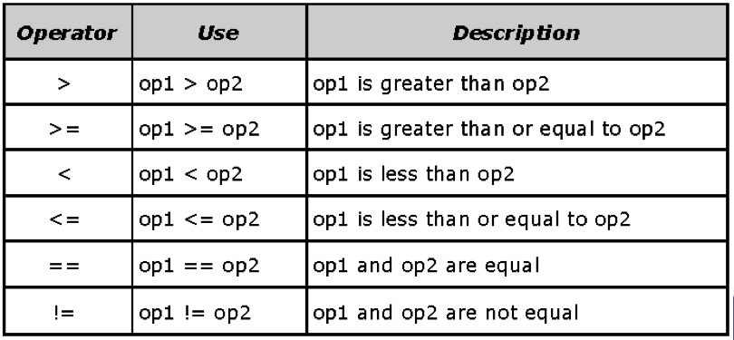
</p>

Here is a program that illustrates the if statement:

```java  
/*
Demonstrate the if.
Call this file "IfSample.java". 
*/
class IfSample {
    public static void main(String args[]) {
        int x, y;

        x = 10;
        y = 20;

        if (x < y) {
            System.out.println("x is less than y");
        }

        x = x * 2;
        if (x == y) {
            System.out.println("x now equal to y");
        }

        x = x * 2;
        if (x > y) {
            System.out.println("x now greater than y");
        }

        // this won't display anything
        if (x == y) {
            System.out.println("you won't see this");
        }
    }
}
```
The output generated by this program is shown here:

    x is less than y
    x now equal to y
    x now greater than y

Notice one other thing in this program. The line

```java
int x, y
```
declares two variables, **x** and **y**, by use of a comma-separated list.

</div>

<h2>The for Loop</h2>

<div style="text-align: justify">

Java supplies a powerful assortment of loop constructs. Perhaps the most versatile is the for loop. The simplest form of the for loop is shown here:

```java    
for(initialization; condition; iteration) { 
    statement;     
}
```

Where:
- the _initialization_ portion of the loop sets a loop control variable to an initial value.
- _condition_ is a boolean expression that tests the loop control variable if the result of the expression is true, the for loop continue iterating, is the result is false the loop terminates
- _iteration_ expression determines how the loop control variable is changed each time the loop iterates

Here is a short program that illustrates the for loop:

```java    
/*
Demonstrate the for loop.
Call this file "ForTest.java". 
*/
class ForTest {
   public static void main(String args[]) {
       int x;

       for (x = 0; x < 10; x = x + 1) {
           System.out.println("This is x: " + x);
       }
   }
}
```
This program generates the following output:

    This is x: 0
    This is x: 1
    This is x: 2
    This is x: 3
    This is x: 4
    This is x: 5
    This is x: 6
    This is x: 7
    This is x: 8
    This is x: 9

In this example, **x** is the loop control variable. It is initialized to zero in the initialization portion of the **for**. At the start of each iteration (including the first one), the conditional test **x < 10** is performed. If the outcome of this test is true, the **println( )** statement is executed, and then the iteration portion of the loop is executed, which increases **x** by 1. This process continues until the conditional test is false.

Java provides a special increment operator which performs the operation **x = x+1** more efficiently. The operator is **++**. The increment operator increases its operand by one. By use of the increment operator we can increment **x** like this:

    x++;


</div>

<h1>Using Blocks of Code</h1>

<div style="text-align: justify">

Java allows two or more statements to be grouped into _blocks of code_, also called _code blocks_. This is done by enclosing the statements between opening and closing curly braces. Once a block of code has been created, it becomes a logical unit that can be used any place that a single statement can. For example, a block can be a target for Java’s **if** and **for** statements.

Consider this **if** statement:
```java  
if(x < y) { // begin a block 
    x = y;
    y = 0;
}           // end of block
```

Here, if **x** is less than **y**, then both statements inside the block will be executed.
</div>


<h1>Lexical Issues</h1>

<div style="text-align: justify">

Is time to more formally describe the atomic elements of Java. Java programs are a collection of whitespace, identifiers, literals, comments, operators, separators, and keywords.

<h2>Whitespace</h2>

Java is a free-form language. This means that you do not need to follow any special indentation rules. For instance, the **Example** program could have been written all on one line or in any other strange way you felt like typing it, as long as there was at least one whitespace character between each token that was not already delineated by an operator or separator. In Java, whitespace is a space, tab, or newline.

<h2>Indetifiers</h2>

Identifiers are used to name things, such as classes, variables, and methods. An identifier may be any descriptive sequence of uppercase and lowercase letters, numbers, or the underscore and dollar-sign characters. Java is case-sensitive, so **DATA** is a different identifier than **data**. Some examples of valid identifiers are:

<p align="center">
    
</p>

Invalid identifiers:

<p align="center">
    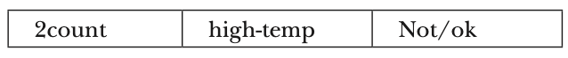
</p>


<h2>Literals</h2>
A constant value in Java is created by using a literal representation of it. For example, here are some literals:

<p align="center">
    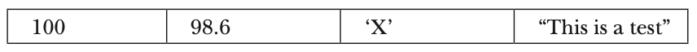
</p>

Left to right, the first literal specifies an integer, the next is a floating-point value, the third is a character constant, and the last is a string. A literal can be used anywhere a value of its type is allowed.

<h2>Comments</h2>

As mentioned, there are three types of comments defined by Java. You have already seen two: _single-line_ and _multiline_. The third type is called a _documentation_ comment. This type of comment is used to produce an HTML file that documents your program. The documentation comment begins with a /** and ends with a */.

<h2>Separators</h2>

In Java, there are a few characters that are used as separators. The most commonly used separator in Java is the semicolon. The separators are shown in the following table:

<p align="center">
    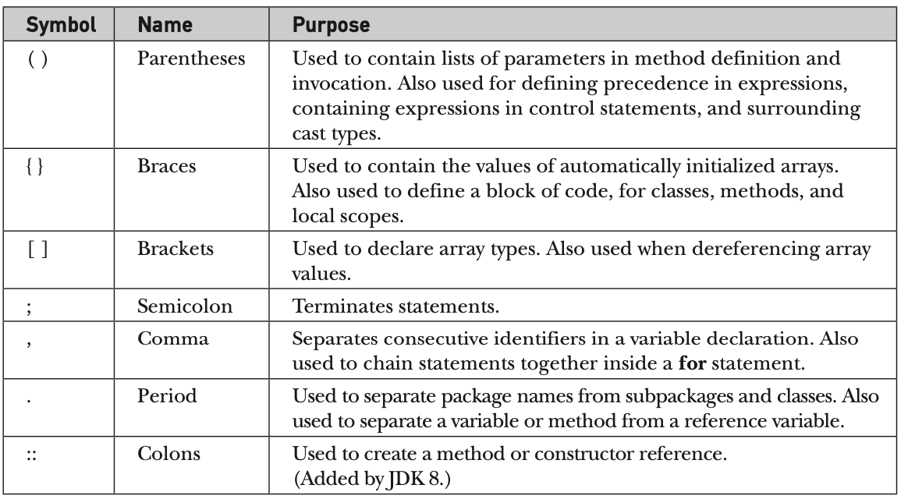
</p>

<h2>The Java Keywords</h2>
There are 50 keywords currently defined in the Java language (see Table 2-1). These keywords, combined with the syntax of the operators and separators, form the foundation of the Java language. These keywords cannot be used as identifiers. 

<p align="center">
    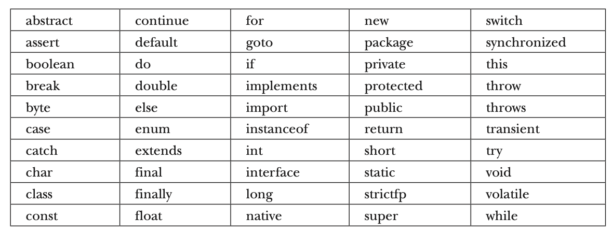
</p>

In addition to the keywords, Java reserves the following: **true**, **false**, and **null**.

</div>

<h1>The Java Class Libraries</h1>

<div style="text-align: justify">

- The methods **println()** and **print()** are part of the **System** class provided by java that is automatically included in every program.
- Java environment relies on several built-int class libraries that contain many built-it methods
- Java = Java language + standard classes
- Part to becoming Java programmer is learning to use standard java classes

</div>