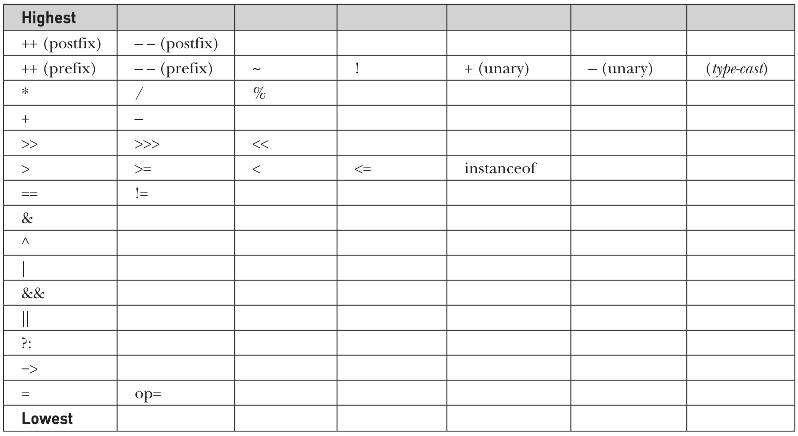

# Chapter 03 - Operators

## Table of content
1. [What's an operator?](##Whats-an-operator)
1. [Assignment operators](##Assignment-Operators)
1. [Arithmetic Operators](##Arithmetic-Operators)
1. [The add + operator in strings.](##add-in-string)
1. [Increment/Decrement Operators](##Increment/Decrement-Operators)
1. [Bitwise Operators](##Bitwise-Operators)
1. [Relational Operators](##Relational-Operators)
1. [Logical Operators](##Logical-Operators)
1. [Truth tables](##truth-tables)
1. [Operator Precedence](##operator-precedence)
1. [Parentheses](##parentheses)
1. [Exercises](##exercises)
---------------------------------------------------------------------

## [What's an operator?](whats-an-operator)

An `operator` is a symbol that operates on one or more arguments to produce a result.
The operator takes an action on the arguments being passed for the operation, concluding the action with a result.

Java has a rich operator environment, allowing you the flexibility to do your tasks.

The `operands` are the values on which the operators act upon. 
They can be: 
* **A numeric variable** - integer, floating point or character.
* **Any primitive type variable** - numeric and boolean.
* **Reference variable** to an `object`.
* **A literal** - numeric value, boolean value, or string.
* **An array element**, `array[2]`.
* **Char primitive**, which in numeric operations is treated as an unsigned two byte integer.

## Types of operators

1. [Assignment operators](##Assignment-Operators)
1. [Arithmetic Operators](##Arithmetic-Operators)
1. [Increment/Decrement Operators](##Increment/Decrement-Operators)
1. [Bitwise Operators](##Bitwise-Operators)
1. [Relational Operators](##Relational-Operators)
1. [Logical Operators](##Logical-Operators)


## [Assignment Operators](Assignment-Operators)
Assignment operators are used in Java to assign values to variables.
The assignment operator assigns the value on its right to the variable on its left.
For example: 
```java 
int x = 2;
int y = x + 1;
```

## [Arithmetic Operators](Arithmetic-Operators)

The arithmetic operators are used to construct mathematical expressions as in algebra.
Their operands are of numeric type.

| Operator 	| Result                    	| Example                     	|
|:---------:|---------------------------	|-----------------------------	|
|     +    	| Addition                  	| 1 + 2, a + b, c + 3         	|
|     -    	| Subtraction               	| 2 - 1, a - b, c - 3         	|
|     *    	| Multiplication            	| 1 * 2, a * b, c * 3         	|
|     /    	| Division                  	| 2 / 1, a / b, c / 3         	|
|     %    	| Modulus                   	| 9 % 2 = 1, a % b = 1        	|
|    ++    	| Increment                 	| x++ == x = x + 1            	|
|    --    	| Decrement                 	| x-- == x = x - 1            	|
|    +=    	| Addition assignment       	| x += 3 == x = x + 3, x += y 	|
|    -=    	| Subtraction assignment    	| x -= 3 == x = x - 3, x -= y 	|
|    *=    	| Multiplication assignment 	| x *= 3 == x = x * 3, x *= y 	|
|    /=    	| Division assignment       	| x /= 3 == x = x / 3, x /= y 	|
|    %=    	| Modulus assignment        	| x %= 3 == x = x % 3, x %= y 	|


### Simple arithmetic.
The `addition + `, `subtraction - `, `multiplication * ` and `division / ` operators are the basic math operators for sum, subtract, multiply or divide, respectively.

The `modulus % ` returns the value of the remanent of a division. This is when a division is no exact and you get decimals as a result. Example:
`9 / 2 = 4.5`, where ` 2 * 4 = 8`, the `modulus` will be the `1` missing to get to `9`.
So `9 % 2 = 1`.

Example: 
```java
static void simpleArithmetic(){
    int x = 9;
    int y = 2;

    int add = x + y;
    int subtract = x - y;
    int multiply = x * y;
    int divide = x / y;
    int modulus = x % y;

    System.out.println("x = " + x);
    System.out.println("y = " + y);
    System.out.println("Addition = " + add);
    System.out.println("Subtraction = " + subtract);
    System.out.println("Multiplication = " + multiply);
    System.out.println("Division = " + divide);
    System.out.println("Modulus = " + modulus);
}
```
```
x = 9
y = 2
Addition = 11
Subtraction = 7
Multiplication = 18
Division = 4
Modulus = 1
```

### [The add + operator in strings.](add-in-string)
The + operator can also be used to concatenate two or more strings and even concatenate variable values, which allows you to do more with your strings and even help you assign or display values clearly.

Example:
```java
static void strings(){
    String s = "This is an variable.";
    String st = "You can have one " + "or more strings concatenated in a variable.";
    System.out.println("This is how you print a string and concatenate variables. "
            + s + " " + st + " And even numbers = " + 10 );
}
```
```
This is how you print a string and concatenate variables. This is an variable. You can have one or more strings concatenated in a variable. And even numbers = 10
```


## [Increment/Decrement Operators](Increment/Decrement-Operators)
The ` ++ ` operator increases value by 1 and `--` decreases the value by 1. We can simply look at them as shortcuts or a simplified or unified operator for counters.
```java
x++   ==   x = x + 1
x--   ==   x = x - 1
```

You can also use ++ and -- operator as both prefix and postfix in Java. 
* As `prefix`: Adds to the value `immediately ` when it's accessed.
Meaning: when you interact with the operator, it will change its value (increase or decrease) at that moment.
* As `postfix`: Adds to the value `after` it has been accessed.
Meaning: when you interact with the operator, the operation will take action with the number it has, and once the operation is completed, the value will change accordingly.

Example:
```java
static void increments(){
    int x = 10;

    System.out.println("  x = " + x); 
    // We just simply print the variable, no change has been done to it yet, x = 10.
    System.out.println("x++ = " + x++);
    // This prints x = 10 since the operator will act after the operation (in this case, printing) ends, but once this is finished, x will have the new value of 11.
    System.out.println("  x = " + x); 
    // and that's what we get here, x = 11, because the value was changed from the previous operation.
    System.out.println("++x = " + ++x); 
    // In here, the value immediately changes so the operation will act upon the updated value, which is now x = 12
    System.out.println("  x = " + x); 
    }
```
```
  x = 10
x++ = 10
  x = 11
++x = 12
  x = 12
```
## [Arithmetic assignments](Arithmetic-assignments)
These operators allows you to do an arithmetic operation (`+`, `-`, `*`, `/`, ` %`) on a variable, and assign the result to the variable itself, updating its value to the result of the operation.

Example:
```java
static void arithmeticAssignments(){
    int x = 5;
    int y = 2;
    int a = x + 1;

    x += y; // x = x + y;
    y -= 0; // y = y - 0;
    x *= 2; // x = x * 2;
    y /= 2; // y = y / 2;
    a %= y; // a = a % y;

    System.out.println("x = " + x);
    System.out.println("y = " + y);
    System.out.println("a = " + a);
}
```
```
x = 14
y = 1
a = 0
```

## [Bitwise Operators](Bitwise-Operators)
Java's bitwise operators operate on individual bits of the integer types: long, int, short, char, and byte  values.
If an operand is shorter than an int, it is promoted to int before  doing the operations.
All of the integer types are represented by binary numbers of varying bit widths.

This operators are mostly used in systems that are very low on specs, where you need to carefully use resources, there's a big need of efficiency because of the limitation of resources.

| Operator 	| Result                           	|
|:---------:|----------------------------------	|
|     ~    	| Bitwise unary NOT                	|
|     &    	| Bitwise AND                      	|
|    \|    	| Bitwise OR                       	|
|     ^    	| Bitwise exclusive OR             	|
|    >>    	| Shift right                      	|
|    >>>   	| Shift right zero fill            	|
|    <<    	| Shift left                       	|
|    &=    	| Bitwise AND assignment           	|
|    \|=   	| Bitwise OR assignment            	|
|    ^=    	| Bitwise exclusive OR assignment  	|
|    >>=   	| Shift right assignment           	|
|   >>>=   	| Shift right zero fill assignment 	|
|    <<=   	| Shift left assignment            	|

Example:
```java
public static void main(String args[]) {  
    int a = 60; /* 60 = 0011 1100 */
    int b = 13; /* 13 = 0000 1101 */  
    int c = 0;

    c = a & b; /* 12 = 0000 1100 */  
    System.out.println("a & b = " + c );

    c = a | b; / 61 = 0011 1101 */
    System.out.println("a | b = " + c );
}
```

## [Relational Operators](##Relational-Operator)
A relational operator compares two values and determines the relationship between them.
Specifically, they determine equality and ordering.
Relational operators are used to test whether two values are  equal, whether one value is greater than another, and so  forth.
The outcome of these operations is a boolean value.

| Operator 	| Description                                                                                                                     	|
|:--------:	|---------------------------------------------------------------------------------------------------------------------------------	|
|    ==    	| Checks if the value of two operands are equal or not, if yes then condition becomes true.                                       	|
|    !=    	| Checks if the value of two operands are equal or not, if values are not equal then condition becomes true.                      	|
|     >    	| Checks if the value of left operand is greater than the value of right operand, if yes then condition becomes true.             	|
|     <    	| Checks if the value of left operand is less than the value of right operand, if yes then condition becomes true.                	|
|    >=    	| Checks if the value of left operand is greater than or equal to the value of right operand, if yes then condition becomes true. 	|
|    <=    	| Checks if the value of left operand is less than or equal to the value of right operand, if yes then condition becomes true.    	|

Example:
```java
// In this example, only the operations that will result 'true' are going to be printed out.
static void relationals(){
    int x = 1;
    String y = "1";
    int z = 2;

    if ( x == 1 ) { System.out.println("true: x == 1"); }
    if ( x != 1 ) { System.out.println("true: x != y"); }
    if ( x < z )  { System.out.println("true: x < z"); }
    if ( x > z )  { System.out.println("true: x > z"); }
    if ( x >= 3 ) { System.out.println("true: x >= 3"); }
    if ( x <= 1 ) { System.out.println("true: x <= 1"); }
}
```
```
true: x == 1
true: x < z
true: x <= 1
```

## [Logical Operators](Logical-Operators)
The Boolean logical operators shown here operate only on boolean operands. 
All of the binary logical operators combine two boolean values to form a resultant boolean value.

These operators mainly compare two or more operations to verify a condition.

| Operator 	| Result                     	| Description                                                                                          	|
|:--------:	|----------------------------	|------------------------------------------------------------------------------------------------------	|
|     &    	| Logical AND                	| If both the operands are true then then condition becomes true.                                      	|
|    \|    	| Logical OR                 	| If any the operands are true then then condition becomes true.                                       	|
|     ^    	| Logical XOR (exclusive OR) 	| If both the operands are different then then condition becomes true.                                 	|
|    &&    	| Short-circuit AND          	| If the first operand is false, it doesn't check the second one since the condition is already false. 	|
|   \|\|   	| Short-circuit OR           	| If the first operand is true, it doesn't check the second one since the condition is already true.   	|
|     !    	| Logical unary NOT          	| Inverts the Boolean state                                                                            	|
|    &=    	| AND assignment             	| Evaluates itself against another operand, does an AND and assigns itself the result                  	|
|    \|=   	| OR assignment              	| Evaluates itself against another operand, does an OR and assigns itself the result                   	|
|    ^=    	| XOR assignment             	| Evaluates itself against another operand, does an XOR and assigns itself the result                  	|
|    ==    	| Equal to                   	| Validates if both conditions are true                                                                	|
|    !=    	| Not equal to               	| Validates if both conditions are false                                                               	|
|    ? :   	| Ternary if-then-else       	| One-line if condition                                                                                	|

## [Truth tables](truth-tables)
Truth tables helps you visualize how logical operators behave according to the values of their operands. You can usually use them to understand a logical operation, came up with a strategy on operations you may have to add or simple have a visual representation of these operators interacting with both values.

| A 	| B 	| A & B 	| A \| B 	| A ^ B 	|
|:-:	|:-:	|:-----:	|:------:	|:-----:	|
| 0 	| 0 	|   0   	|    0   	|   0   	|
| 0 	| 1 	|   0   	|    1   	|   1   	|
| 1 	| 0 	|   0   	|    1   	|   1   	|
| 1 	| 1 	|   1   	|    1   	|   0   	|

---------------------------------------------------------

|   A   	|   B   	| A & B 	| A \| B 	| A ^ B 	|
|:-----:	|:-----:	|:-----:	|:------:	|:-----:	|
| FALSE 	| FALSE 	| FALSE 	|  FALSE 	| FALSE 	|
| FALSE 	|  TRUE 	| FALSE 	|  TRUE  	|  TRUE 	|
|  TRUE 	| FALSE 	| FALSE 	|  TRUE  	|  TRUE 	|
|  TRUE 	|  TRUE 	|  TRUE 	|  TRUE  	| FALSE 	|


## [Operator Precedence](operator-precedence)
Table shows the order of precedence for Java operators, from highest to lowest. Operators in the same row are equal in precedence.



## [Parentheses](parentheses)

Parentheses raise the precedence of the operations that are inside them. This is often necessary to obtain the result you desire, kind of following . They mark the start and end of the parameter list.
For example, consider the following expression:
```java
a * b + 3
```
This expression first multiplies a and b, and then it adds 3 to b.  However, if you want to first add 3 to b and then multiply that result by a, you can prioritize them with parentheses
```java
a * (b + 3)
```

## [Exercises](exercises)
1. Consider the following code snippet:
    ```java
    int i = 10;
    int n = i++%5;
    ```

    * What are the values of i and n after the code is executed?
    * What are the final values of i and n if instead of using the postfix increment operator (`i++`), you use the prefix version (`++i`))?

1. Which statements are true?
    ```java
    x = 6; 
    y = 3;

    1. x % y == 0 
    2. 3x >= -2 && x <= 13 
    3. 4x - y < 5 || y – x < 5
    ```