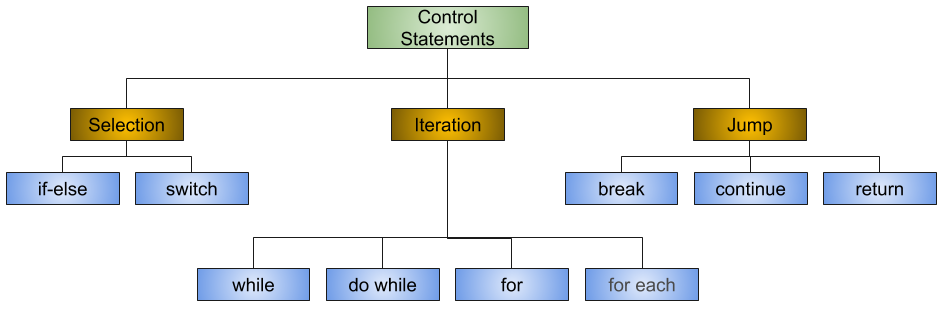
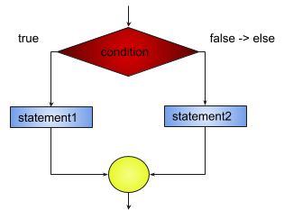
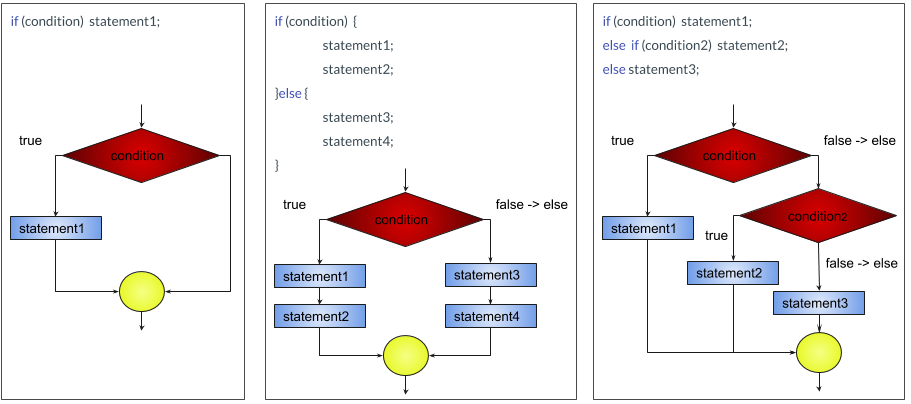
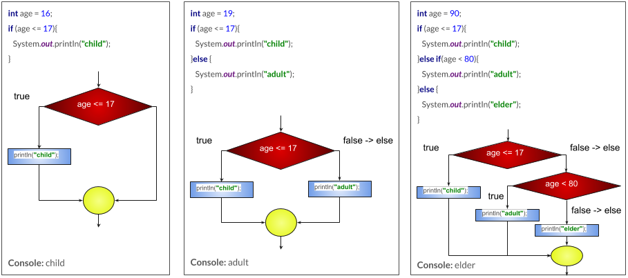

# Chapter 05 - Control Statements


Control Statements

A programming language uses control statements to cause the flow of execution to advance
and branch based on changes to the state of a program. Java’s program control statements
can be put into the following categories: selection, iteration, and jump. 

1. Selection statements: Allow your program to choose different paths of execution based upon the outcome of an
2. expression or the state of a variable. 
3. Iteration statements: Enable program execution to repeat one or more statements. 
Jump statements: Allow your program to execute in a nonlinear fashion.



Selection Statements

1. If

An if construct enables you to execute a set of statements in your code based on the result of a condition. This condition must always evaluate to a boolean or a Boolean value. You can specify a set of statements to execute when this condition evaluates to true or false.

 
```java
boolean condition = true;
if (condition)  {
  statement1; // code to be executed if the condition is true
  statementN;
}else {
  statement2; // code to be executed if the condition is not true
  statementN;
}
```

Multiple flavors of if statements can be used.

1. if.
2. if-else.
3. if-else-if-else.



Example:

Write a java program that reads an age variable and prints the following:
  1. If age is less or equal 17 prints child.
  2. If age is greater than 17 prints adult, but...
  3. If age is 80 or more prints elder.
  
  
  
Nested ifs

A nested if is an if statement that is the target of another if or else. Nested ifs are very
common in programming. When you nest ifs, the main thing to remember is that an else
statement always refers to the nearest if statement that is within the same block as the else
and that is not already associated with an else.

Example:
```java
if(i == 10) {
   if(j < 20) a = b;
   if(k > 100) c = d;
   else a = c; 
}
else a = d; 
```
Organized:

```java
if(i == 10) {
   if(j < 20) {
       a = b;
   }
   if(k > 100) { // this if is
       c = d;
   }else { // associated with this else
       a = c;
   }
}
else { // this else refers to if(i == 10)
   a = d;
}
```

The final else is not associated with if(j<20) because it is not in
the same block (even though it is the nearest if without an else). Rather, the final else is
associated with if(i==10). The inner else refers to if(k>100) because it is the closest if within
the same block.


