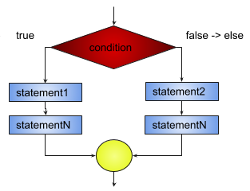
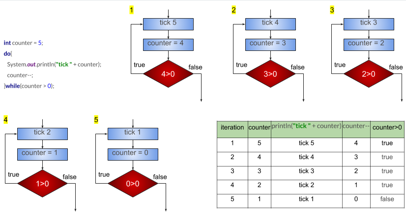
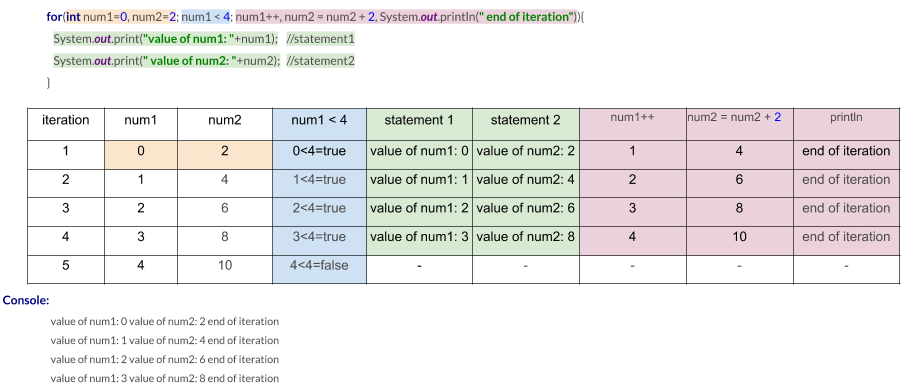
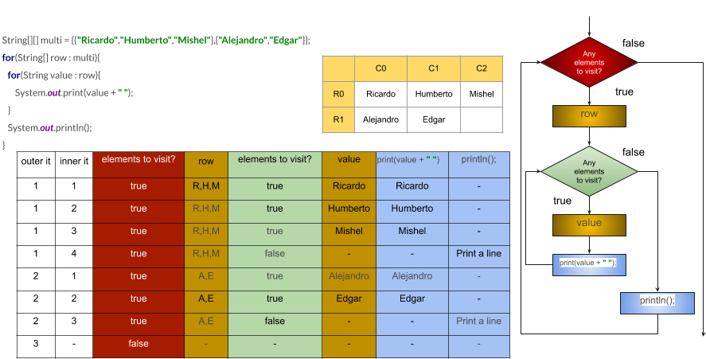

# Chapter 05 - Control Statements


Control Statements

Java uses control statements to cause the flow of execution to advance and branch based on changes to the state of a program. Control statements can be categorized into: selection, iteration, and jump. 

1. Selection statements: Allow your program to choose different paths of execution based upon the outcome of an expression or the state of a variable.
2. Iteration statements: Enable program execution to repeat one or more statements.
3. Jump statements: Allow your program to execute in a nonlinear way.


Selection Statements

1. If

An if statement enables you to execute a set of statements in your code based on the result of a condition. This condition must always evaluate to a boolean or a Boolean value. 

Flow diagram of an if statement:

 

A common if statement looks like the following code:

```java
boolean condition = true;
if (condition)  {
  statement1; // code to be executed if the condition is true
  statementN;
}else {
  statement2; // code to be executed if the condition is not true
  statementN;
}
```

Multiple flavors of if statements can be used.

1. if.
2. if-else.
3. if-else-if-else.


Example:

Write a java program that reads an age variable and prints the following:
  1. If age is less or equal 17 prints child.
  2. If age is greater than 17 prints adult, but...
  3. If age is 80 or more prints elder.
  
  
  
```java  
int age = 90;
if (age <= 17){
   System.out.println("child");
}else if(age < 80){
   System.out.println("adult");
}else {
   System.out.println("elder");
}
```
  
Nested ifs

A nested if is an if statement that is the target of another if or else. Nested ifs are very
common in programming. When you nest ifs, the main thing to remember is that an else
statement always refers to the nearest if statement that is within the same block as the else
and that is not already associated with an else.

Example:
```java
if(i == 10) {
   if(j < 20) a = b;
   if(k > 100) c = d;
   else a = c; 
}
else a = d; 
```
Organized:

```java
if(i == 10) {
   if(j < 20) {
       a = b;
   }
   if(k > 100) { // this if is
       c = d;
   }else { // associated with this else
       a = c;
   }
}
else { // this else refers to if(i == 10)
   a = d;
}
```

The final else is not associated with if(j<20) because it is not in the same block (even though it is the nearest if without an else). Rather, the final else is associated with if(i==10). The inner else refers to if(k>100) because it is the closest if within the same block.

2. switch.

You can use a switch statement to compare the value of a variable with multiple values. For each of these values, you can define a set of statements to execute. 


A common switch statement looks like the following code:

```java
switch (expression) {
  case value1:
    // statement sequence
  break;
  case value2:
 	  // statement sequence
  break;
    ...
  case valueN:
    // statement sequence
  break;
  default:
    // default statement sequence
}
```

Expression must be of type byte, short, int, char, enumeration, String or equivalent wrappers.

Each value specified in the case statements must be a unique constant expression. Duplicate case values are not allowed. The type of each value must be compatible with the type of expression.

The switch statement works like this: The value of the expression is compared with each of the values in the case statements. If a match is found, the code sequence following that case statement is executed. If none of the constants matches the value of the expression, then the default statement is executed. However, the default statement is optional. If no case matches and no default is present, then no further action is taken. 

The break statement is used inside the switch to terminate a statement sequence. When a break statement is encountered, execution branches to the first line of code that follows the entire switch statement. In the absence of the break statement, control will fall through the  remaining  code  and  execute  the  code  corresponding  to  all  the remaining  cases that follow that matching case.

Example:

Write a java program (using a switch statement) that reads a String day variable and prints the following:

* If day is equal to  MON, TUE, WED, THU or FRI, prints time to work.
* If day is equal to SAT or SUN, prints Weekend!.
* If day takes another value, prints invalid day?


```java
String day = "SUN";
switch (day) {
   case "MON":
   case "TUE":
   case "WED":
   case "THU":
   case "FRI":
        System.out.println("Time to work");
       break;
   case "SAT":
   case "SUN":
       	System.out.println("Weekend!");
       break;
   default:
       	System.out.println("Invalid day?");
}
```

```
Console: 
  Weekend!
```

Iteration statements

1. while

The while loop is Java’s most fundamental loop statement. It repeats a statement or block while its controlling condition is true.


```java
boolean condition = true;
while(condition) {
  statement1; // code to be executed if the condition is true
  ...
}
```

The condition can be any Boolean or boolean expression. The body of the loop will be executed as long as the conditional expression is true. When condition becomes false, control passes to the next line of code immediately following the loop. The curly braces are unnecessary if only a single statement is being repeated.

Example 1:

Write a java program that simulates a counter for a bomb it has to start the countdown in 5 and print countdown as follows:

thick 5

thick 4

thick 3

thick 2

thick 1

Each iteration is shown in the following image:


```java
int counter = 5;
while(counter > 0) {
   System.out.println("tick " + counter);
   counter--;
}
```

```
Console: 
  tick 5
  tick 4
  tick 3
  tick 2
  tick 1
```


Example 2:

Write a java program that finds the midpoint between 10 and 20.

Each iteration is shown in the following image:


```java
nt n1 = 10;
int n2 = 20;
while(++n1 < --n2);
System.out.println("Midpoint is " + n1);
```
```
Console: 
  Midpoint is 15
```

2. do while.

The do-while loop always executes its body at least once, because its conditional expression is at the bottom of the loop. The conditional must be a Boolean or boolean expression.


```java
boolean condition = true;
do {
   statement1; // code to be executed at least once
    ...
} while (condition);
```
Example:

Write a java program that simulates a counter for a bomb it has to start the countdown in 5 and print countdown as follows:

thick 5

thick 4

thick 3

thick 2

thick 1

Each iteration is shown in the following image:



```java
int counter = 5;
do{
   System.out.println("tick " + counter);
   counter--;
}while(counter > 0);
```
```
Console: 
  tick 5
  tick 4
  tick 3
  tick 2
  tick 1
```

3. for.

A for loop is usually used to execute a set of statements a fixed number of times.

```java
for(initialization; condition; iteration) {
  statement1; // code to be executed
  …
}
```


The for loop operates as follows:

1. Initialization:
* The initialization portion of the loop is executed, as soon as the loop starts. 
* The initialization is an expression that sets the value of the loop control variable, which acts as a counter that controls the loop. 
* Java can initialize multiple variables in this section, but all must be of the same type.
* The initialization expression is executed only once. 
2. Condition:
* The condition is evaluated. This must be a Boolean or boolean expression. 
* Tests the loop control variable against a target value. 
* If this expression is true, then the body of the loop is executed. If it is false, the loop terminates. 
3. Iteration:
* This is usually an expression that increments or decrements the loop control variable. 
* Java can execute statements in this section.


The loop then iterates, first evaluating the conditional expression, then executing the body of the loop, and then executing the iteration expression with each pass. This process repeats until the controlling expression (condition) is false.

Example 1:

Write a java program that simulates a counter for a bomb it has to start the countdown in 5 and print countdown as follows:

thick 5

thick 4

thick 3

thick 2

thick 1

Each iteration is shown in the following image:


```java
for(int counter = 5; counter > 0; counter--) {
   System.out.println("tick " + counter);
}
```
```
Console: 
  tick 5
  tick 4
  tick 3
  tick 2
  tick 1
```

Example 2:




```java
for(int num1=0, num2=2; num1 < 4; num1++, num2 = num2 + 2, System.out.println(" end of iteration")){
   System.out.print("value of num1: "+num1);	//statement1
   System.out.print(" value of num2: "+num2);	//statement2
}
```

Example 3:

Having this array {6,8,9,1}, create a java program that:
* Prints the position in the array and the value of each element.
* Prints the sum of the elements in the array.


```java
int sum = 0;
int[] array = {6, 8, 9, 1};
for (int position = 0; position < array.length; position++){
   System.out.println("position: " + position +" value: "+ array[position]);	//statement1
   sum = sum + array[position];						//statement2
}
System.out.println("sum: "+sum);						//statement3
```

4. for each.

A for-each style loop is designed to cycle through a collection of objects, such as an array, in strictly sequential fashion, from start to finish.

```java
int[] collection = {1,2,3}
for(type iter-var : collection){
  statement1; // code to be executed if there are more elements in the collection.
  …
}
```


Example 1:

Having this array {6,8,9,1}, create a java program (using a for each sentence) that:
* Prints the value of each element.
* Prints the sum of the elements in the array.


```java
int[] array = {6, 8, 9, 1};
int sum = 0;
for(int value : array){
   sum = sum + value;
}
System.out.println("sum: " + sum);
```

Example 2:

Create a java program that prints the elements of the matrixA by row.
  matrixA={{"Ricardo","Humberto","Mishel"},{"Alejandro","Edgar"}}



```java
String[][] multi = {{"Ricardo","Humberto","Mishel"},{"Alejandro","Edgar"}};
for(String[] row : multi){
   for(String value : row){
       System.out.print(value + ",");
   }
   System.out.println();
}
```

Jump Statements

1. break.

In Java, the break statement has three uses. 

1. It terminates a statement sequence in a switch statement (We already see this use in the switch statement section). 
2. It can be used to exit a loop. 
3. It can be used as a form of goto using labeled statements(not explained in this document).

Using break to Exit a Loop.

By using break, you can force immediate termination of a loop, bypassing the conditional expression and any remaining code in the body of the loop. When a break statement is encountered inside a loop, the loop is terminated and program control resumes at the next statement following the loop.


Example 1:

Having this array {6,8,9,1}, create a java program (using a for each sentence) that:

* Prints the value of each element.
* If the number 8 is found in the array, the program stops printing values.

```java
int[] array = {6, 8, 9, 1};
for(int value : array){
   if(value == 8){
       break;
   }
   System.out.println(value);
}
System.out.println("out of loop");
```


2. continue.

In Java, the continue statement has two uses. 

2. It can be used to exit the current iteration in a loop. 
3. It can be used as a form of goto using labeled statements(not explained in this document).

Using continue statement to exit the current iteration in a loop. 

The continue  statement  is  used  to  skip  the  remaining  steps  in  the  current  iteration and start with the next loop iteration. 


Example:

Having this array {6,8,9}, create a java program (using a for each sentence) that:

* Prints the value of each element.
* If the number 8 is found in the array, the program skips printing that number.

```java
int[] array = {6, 8, 9};
for(int value : array){
   if(value == 8){
       continue;
   }
   System.out.println(value);
}
System.out.println("out of loop");
```


3. return.

The return statement is used to explicitly return from a method. That is, it causes program control to transfer back to the caller of the method.

Let's review the next code whitout the use of return:

```java
public class Main {
   public static void main(String[] args) {
       System.out.println("before call");
       methodToCall(true);
       System.out.println("after call");
   }
   private static void methodToCall(boolean condition) {
       if(condition){
           System.out.println("in condition");
       }
       System.out.println("not returning");
       System.out.println("end of method and returning");
   }
}
```

It prints in console:

```
Console: 
  before call
  in condition
  not returning
  end of method and returning
  after call
```

If we add a return statement into the if statement in the method methodToCall():

```java
public class Main {
   public static void main(String[] args) {
       System.out.println("before call");
       methodToCall(true);
       System.out.println("after call");
   }
   private static void methodToCall(boolean condition) {
       if(condition){
           System.out.println("in condition and return");
           return;
       }
       System.out.println("not returning");
       System.out.println("end of method and returning");
   }
}
```

Now it prints in console:

```
Console: 
  before call
  in condition and return
  after call
```
    
As we can see, when the condition is true, the execution of the method methodToCall() enters into the if and executes the return statement, this makes the execution flow to return to the caller method (the main method) and in this case System.out.println("not returning"); and System.out.println("end of method and returning"); statements are not executed.


