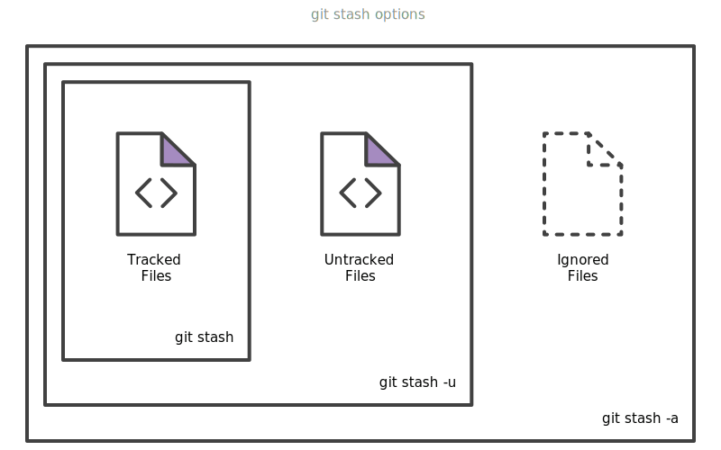

# Chapter 06 - Git Version Control

## History
Git (*ɡɪt*). Linus Torvalds wanted a distributed system that he could use like BitKeeper, but none of the available free systems met his needs. For his design criterion, he specified that patching should take no more than three seconds, and added three more points:
* Take Concurrent Versions System (CVS) as an example of what not to do; if in doubt, make the exact opposite decision.
* Support a distributed, BitKeeper-like workflow.
* Include very strong safeguards against corruption, either accidental or malicious.

## SVN vs. GIT
SVN tracks differences of a file, Git’s version control model is based on snapshots. For example, a SVN commit consists of a diff compared to the original file added to the repository. Git, on the other hand, records the entire contents of each file in every commit.

<div>
  <p align="center">
    
  </p>
</div>

## Installing
**How to install?** [Atlassian guide](https://www.atlassian.com/git/tutorials/install-git) **Note:** There are several ways to install Git. Use what you like

* How to setup user/email?
```console
# Verifying username
$ git config user.email
# Adding username
$ git config user.email <your@email.here>
```

## Getting and Creating Projects
* What is a repository?
A Git repository is a virtual storage of your project. It allows you to save versions of your code, which you can access when needed. 

<div>
  <p align="center">
    
  </p>
</div>

### Creating Repository
```console
# Creating local repository
$ git init
```

* How to create a remote repo?
  * [Github](https://help.github.com/en/enterprise/2.14/user/articles/creating-a-new-repository)
  * [Bitbucket](https://confluence.atlassian.com/bitbucket/create-a-git-repository-759857290.html)

```console
# Setup remote repository
$ git remote add <name> <url>
```

### Cloning Repository
```console
# Cloning remote repository
$ git clone <url>
```

## Snapshotting
### Categories
* **Untracked:** This file exists locally, but isn’t a part of the Git repository. The file’s change history will not be recorded and it will not be pushed to remote copies of your repository when you run `git push`. Unless they’ve been added to an ignore list, untracked files will show up when viewing your Git status.
```console
$ git status
On branch master
Untracked files:
  (use "git add <file>..." to include in what will be committed)

	<file>

nothing added to commit but untracked files present (use "git add" to track)
```
* **Tracked:**  Git tracks the file’s change history and it will be pushed to remote copies when running `git push`. These files will show up in your Git status report if there are differences between the version on your hard drive and the last committed version.
* **Tracked/Unstaged changes** exist in your working directory, but Git hasn’t recorded them into its version history yet. You’ll usually want to *stage* them (mark them to become part of your next commit) or *discard* them by restoring the last committed version of the file.
```console
$ git status
On branch master
Changes not staged for commit:
  (use "git add <file>..." to update what will be committed)
  (use "git restore <file>..." to discard changes in working directory)
  
	modified:   <file>
  
no changes added to commit (use "git add" and/or "git commit -a")
```
* **Tracked/Staged changes** are a lot like unstaged changes, except that they’ve been marked to be committed the next time you run `git commit`. Upon your next commit, your staged changes become part of your Git history. `git status` will no longer list them as changes since they’re part of your last commit now.
```console
$ git status
On branch master
Changes to be committed:
  (use "git restore --staged <file>..." to unstage)
  
	modified:   <file>
```

### Stash
By default, running `git stash` will stash:
* changes that have been added to your index (staged changes)
* changes made to files that are currently tracked by Git (unstaged changes)

But it will not stash:
* new files in your working copy that have not yet been staged
* files that have been ignored

<div>
  <p align="center">
    
  </p>
</div>

### Saving changes
```console
# Staging changes
$ git add <file>
# Commiting changes
$ git commit -m <message>

# TIP: Changing last commit message
$ git commit --amend -m <new message>
```

<div>
  <p align="center">
    
  </p>
</div>

### Undoing changes
```console
# Locating commit (SHA-1)
$ git log --all
# TIP: Single line log
$ git log --pretty=oneline
# Preserving changes
$ git reset --soft <commit>
# Deleting all
$ git reset --hard <commit>
```

## Sharing and Updating Projects
### Fetching and Pushing
```console
# Getting all remotes and their branches
$ git fetch --all
# Pushing commits to remote/branch
$ git push <remote> <branch>
```

### Pull
It’s an easy way to synchronize your local repository with upstream changes. The following diagram explains each step of the pulling process.

<div>
  <p align="center">
    
  </p>
</div>

#### No-Rebase vs Rebase

<div>
  <p align="center">
    
  </p>
</div>

```console
$ git pull <remote>
```
The git pull command first runs git fetch which downloads content from the specified remote repository. Then a git merge is executed to merge the remote content refs and heads into a new local merge commit.

<div>
  <p align="center">
    
  </p>
</div>

```console
$ git pull --rebase <remote>
```
In this diagram, we can now see that a rebase pull does not create the new H commit. Instead, the rebase has copied the remote commits A--B--C and appended them to the local origin/master commit history.

<div>
  <p align="center">
    
  </p>
</div>

## Tagging, Branching and Merging
### Tagging
Tags are ref's that point to specific points in Git history. Tagging is generally used to capture a point in history that is used for a marked version release (i.e. v1.0.1).
```console
# Default Tags
$ git tag <tagname>
# Annotated Tags
$ git tag -a <tagname> -m <message>
```

### Branch
```console
# Creating branch
$ git branch <branch>
# Creating remote branch
$ git push <remote> <branch>

# Deleting branch
$ git branch -d[-D] <branch>
# Deleting remote branch
$ git push <remote> --delete <branch>

# Listing branchs
$ git branch
# Listing remote branchs
$ git branch -r
# Switching branchs
$ git checkout <branch>
```

### Merge
Git merge will combine multiple sequences of commits into one unified history

<div>
  <p align="center">
    
  </p>
</div>

#### Fast Forward Merge
A fast-forward merge can occur when there is a linear path from the current branch tip to the target branch. Instead of “actually” merging the branches, all Git has to do to integrate the histories is move (i.e., “fast forward”) the current branch tip up to the target branch tip.

<div>
  <p align="center">
    
  </p>
</div>

#### 3-way merge
When there is not a linear path to the target branch, Git has no choice but to combine them via a 3-way merge. 3-way merges use a dedicated commit to tie together the two histories.

<div>
  <p align="center">
    
  </p>
</div>

### Conflicts
Conflicts generally arise when two people have changed the same lines in a file, or if one developer deleted a file while another developer was modifying it. Git will mark the file as being conflicted and halt the merging process. It is then the developers' responsibility to resolve the conflict.

#### Changes in working directory
```console
error: Your local changes to the following files would be overwritten by merge:
        <file>
Please commit your changes or stash them before you merge.
Aborting
```

#### Changes in staging area
A failure DURING a merge indicates a conflict between the current local branch and the branch being merged.
```console
error: Your local changes to the following files would be overwritten by merge:
        <file>
```

#### Resolving conflicts
```console
$ git merge <branch>
Auto-merging <file>
CONFLICT (content): Merge conflict in file1.txt
Automatic merge failed; fix conflicts and then commit the result.

# Identify merge conflicts
$ git status
On branch master
You have unmerged paths.
  (fix conflicts and run "git commit")
  (use "git merge --abort" to abort the merge)

Changes to be committed:
	new file:   <ready-file>

Unmerged paths:
  (use "git add <file>..." to mark resolution)
	both modified:   <conflicted-file>

# After editing/save file
$ git add <file>
$ git commit -m <message>
```

## GitFlow
Gitflow utilizes the core feature of Git, which is the power of branches. In this model, a repository has two main branches:
1. **Master**—This is a highly stable branch that is always production-ready and contains the last release version of source code in production.
2. **Develop**—Derived from the master branch, the development branch serves as a branch for integrating different features planned for an upcoming release. This branch may or may not be as stable as the master branch. It is where developers collaborate and merge feature branches.

**Note:** The previous two branches are the starting points for any project. They are very important and should be protected against accidental deletion until the project is better defined. Only authorized leads or project owners should be given the responsibility to merge changes from other branches—such as the feature branch, which we’ll discuss later—to the develop or master branches.

Apart from those two primary branches, there are other branches in the workflow:

3. **Feature**—This derives from the develop branch and is used to develop features.
4. **Release**—This also derives from develop branch but is used during releases.
5. **Hotfix**—This derives from the master branch and is used to fix a bug in the production branch that was identified after a release.

<div>
  <p align="center">
    
  </p>
</div>

## Help
* [What is an SSH KEY?](https://www.atlassian.com/git/tutorials/git-ssh)
* [Git GUI](https://git-scm.com/downloads/guis)
* [On undoing, fixing, or removing commits in git](http://sethrobertson.github.io/GitFixUm/fixup.html)
* [How to do a squash?](https://github.com/wprig/wprig/wiki/How-to-squash-commits)
* Cheat sheets: 
  * [Git](https://git-scm.com/docs)
  * [Github](https://github.github.com/training-kit/downloads/github-git-cheat-sheet.pdf)
  * [Atlassian](https://www.atlassian.com/git/tutorials/atlassian-git-cheatsheet)

## References
* [Wiki](https://en.wikipedia.org/wiki/Git)
* [Git](https://git-scm.com/docs)
* [Atlassian](https://www.atlassian.com/git/tutorials/learn-git-with-bitbucket-cloud)
* [How to git](https://howtogit.archive.pieterdedecker.be/concepts/types-of-changes.html)
* [Axosoft](https://blog.axosoft.com/gitflow/)
