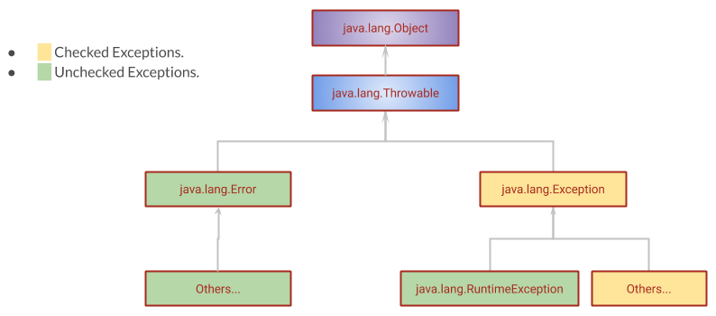
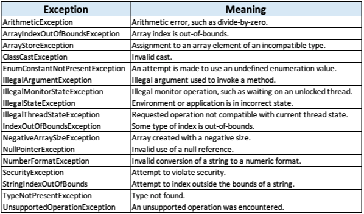
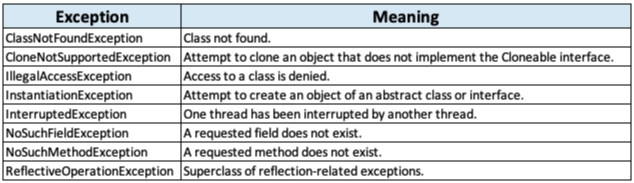
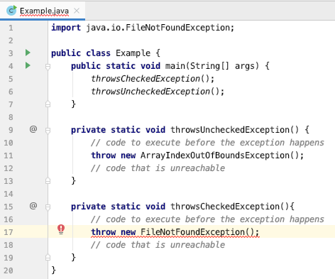
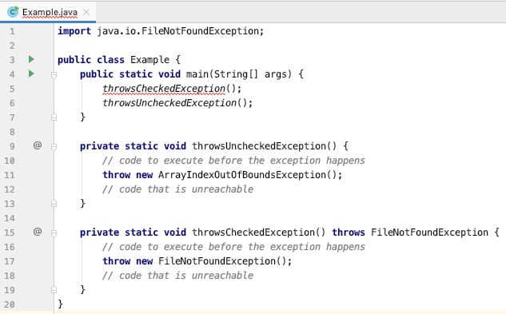
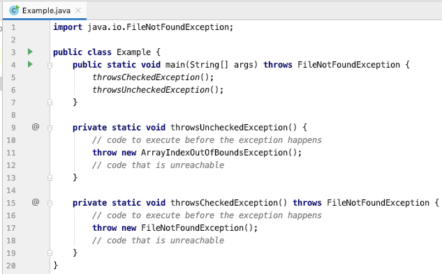
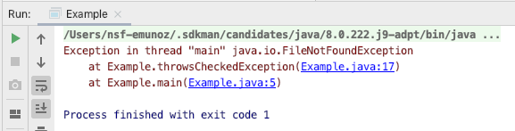
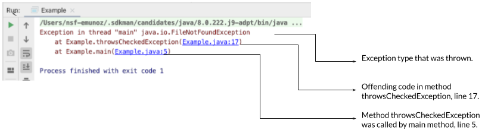
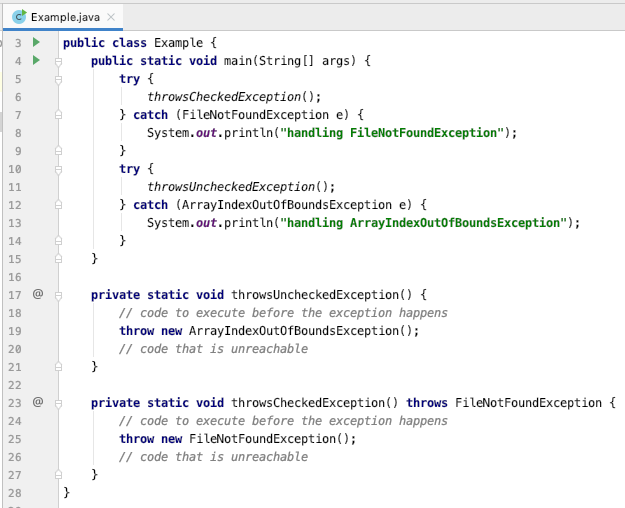
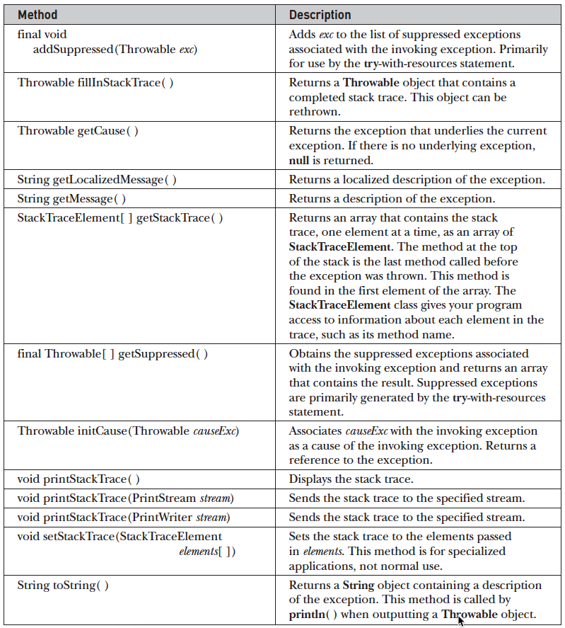

# Chapter 10 - Exception Handling

<h1>Exception Handling</h1>

The term "exception" means "exceptional condition" and is an occurrence that alters the normal flow of a program. 
Many things can lead to exceptions, including hardware failures, resource exhaustion, and bugs.
In java every exception is represented as an instance of a class.

Exception flow:

When an exceptional event occurs in Java:
1. An exception (an object)
2. is said to be "thrown." 
3. then, the "exception handler" (the code that's responsible for doing something about the exception) "catches" the thrown 
exception.


<h2>Exceptions</h2>

<h3>Exception Hierarchy</h3>

All exception types are subclasses of the class Throwable. Throwable is at the top of the exception class hierarchy. 
Immediately below Throwable are two subclasses that partition exceptions into two distinct branches. 

One branch is topped by Error, which defines exceptions that are not expected to be caught under normal circumstances 
by your program. Exceptions of type Error are used by the Java runtime system to indicate errors having to do with the 
runtime environment, itself. Stack overflow is an example of such an error.

The other branch is headed by Exception. This class is used for exceptional conditions that user programs should catch. 
This is also the class that you will subclass to create your own custom exception types. There is an important subclass 
of Exception, called RuntimeException. Exceptions of this type are automatically defined for the programs that you write 
and include things such as division by zero and invalid array indexing.


 
<h3>Some Java’s Built-in RuntimeException Subclasses:</h3>
 


<h3>Some Java’s Built-in Exception Subclasses:</h3>



<h3>Checked and Unchecked exceptions.</h3>

The exceptions in Java are divided into two groups (as marked in the image of the exception hierarchy), checked 
exceptions and unchecked exceptions.

<h4>Checked exceptions:</h4>

* A checked exception is an unacceptable condition foreseen by the author of a method but outside their immediate 
control (it is foreign to the code of the program). For example, FileNotFoundException is a checked exception. 
This exception is thrown if the file that the code is trying to access can’t be found or if it is blocked for another 
application. A method, say, readFile(), can declare it to be thrown when it’s unable to access the target file. 
* Checked exceptions are checked during compilation. If a method call throws a checked exception, the compiler checks 
and ensures that the calling method is either handling the exception or declaring it to be thrown.
* A checked exception is a subclass of the class java.lang.Exception, but it’s not a subclass of 
java.lang.RuntimeException. 

<h4>Unchecked exceptions (Error and RuntimeException)</h4>

Errors:

* An error is a serious exception thrown by the JVM as a result of an error in the environment state that processes 
your code. For example, NoClassDefFoundError is an error thrown by the JVM when it’s unable to locate the .class file 
that it’s supposed to run.  StackOverflowError is another error thrown by the JVM when the size of the memory required 
by the stack of a Java program is greater than what the JRE has offered for the Java application. This error might also 
occur as a result of infinite or highly nested loops.
* An error is a subclass of class java.lang.Error.
* An error need not be a part of a method signature.
* An error can be caught by an exception handler, but it shouldn’t be. 

Runtime exceptions:

* A runtime exception is a representation of a programming error. These occur from inappropriate use of a piece of code. 
For example, NullPointerException is a runtime exception that occurs when a piece of code tries to execute some code on 
a variable that hasn’t been assigned an object and points to null. Another example is ArrayIndexOutOfBoundsException, 
which is thrown when a piece of code tries to access an array element at a nonexistent position.
* A runtime exception isn’t feasible to determine whether a method call will throw a runtime exception until it 
executes.
* A runtime exception is a subclass of java.lang.RuntimeException.
* It’s optional to declare a runtime exception in the signature of a method. It’s up to the person who writes the code 
to decide whether to declare it explicitly or not.


<h2>Throwing an explicit exception:</h2>

When you want a method to throw an exception, the method must:
 
1. Use the throw statement.
2. If it is an unchecked exception, the method must (optionally, for unchecked exceptions):
handle the exception or declare that it throws the exception using the throws clause.

Note: Using the throws clause  is known as “exception propagation”.

<h3>throw statement</h3>

The throw statement throws an exception explicitly and the flow of execution stops immediately after the throw statement; 
any subsequent statements are not executed.

General form:

```java
throw throwableInstance;
```
Here, ThrowableInstance must be an object of type Throwable or a subclass of Throwable.

Using the throw statement in the Example class:

We are going to create the Example class to show you how to explicitly throw a checked and an unchecked exception using 
the throw statement:



Code:

```java
import java.io.FileNotFoundException;

public class Example {
    public static void main(String[] args) {
        throwsCheckedException();
        throwsUncheckedException();
    }

    private static void throwsUncheckedException() {
        // code to execute before the exception happens
        throw new ArrayIndexOutOfBoundsException();
        // code that is unreachable
    }

    private static void throwsCheckedException(){
        // code to execute before the exception happens
        throw new FileNotFoundException();
        // code that is unreachable
    }
}
```

In the image of the Example class, we can see that the class is not compiling because of the throwsCheckedException() 
method, we need to make the method to declare that it throws a checked exception (FileNotFoundException), using the 
throws clause . It is important to note that the method throwsUncheckedException() is compiling fine, because it is 
optional to declare that a method throws an unchecked exception, but mandatory for checked exceptions.

<h3>throws clause</h3>

If a method is capable of causing an exception that it does not handle, it must specify this behavior so that callers 
of the method can guard themselves against that exception. You do this by including a throws clause in the method’s 
declaration. 

A throws clause lists the types of exceptions that a method might throw. This is necessary for all 
exceptions, except those of type Error or RuntimeException, or any of their subclasses. 
All other exceptions that a method can throw must be declared in the throws clause. If they are not, a compiletime 
error will result.

This is the general form of a method declaration that includes a throws clause:

```java
methodModifiers methodReturnType methodName() throws ExceptionType1, ExceptionType2, N  { }
```

Here,

ExceptionType1 ...N, is the type of the exceptions that the method might throw.

Using the throws clause in the throwsCheckedException() method:



Code:
```java
import java.io.FileNotFoundException;

public class Example {
    public static void main(String[] args) {
        throwsCheckedException();
        throwsUncheckedException();
    }

    private static void throwsUncheckedException() {
        // code to execute before the exception happens
        throw new ArrayIndexOutOfBoundsException();
        // code that is unreachable
    }

    private static void throwsCheckedException() throws FileNotFoundException {
        // code to execute before the exception happens
        throw new FileNotFoundException();
        // code that is unreachable
    }
}
```

After adding the throws clause to the throwsCheckedException() method, we can see that now the IDE is telling us that 
the main method has a problem, we need to remember that if a method might throw a checked exception, the method must: 

1. Declare that it throws an exception or
2. Handle the exception.

<h4>Option 1: Declare that main method throws an exception.</h4>

Let's include the throws clause in the main method declaration:



Code:
```java
import java.io.FileNotFoundException;

public class Example {
    public static void main(String[] args) throws FileNotFoundException {
        throwsCheckedException();
        throwsUncheckedException();
    }

    private static void throwsUncheckedException() {
        // code to execute before the exception happens
        throw new ArrayIndexOutOfBoundsException();
        // code that is unreachable
    }

    private static void throwsCheckedException() throws FileNotFoundException {
        // code to execute before the exception happens
        throw new FileNotFoundException();
        // code that is unreachable
    }
}
```

When we execute the program, it prints the stack trace in console as follows:



And we can observe the stack trace in more detail with the following image:



<h4>What happens when an exception is thrown?</h4>

An application starts its execution with the method main, and main may call other methods. 
If main calls another method, the called method should complete its execution before main 
can complete its own execution. 

An operating system keeps track of the code that it needs to execute using a stack.  
This stack uses a stack pointer to point to the instructions that 
the OS should execute.

In this example the stack would look like the following:


 
1. When the method main starts its execution, its instructions are pushed onto the stack.
2. The method main calls the method throwsCheckedException(), and instructions for throwsCheckedException() are pushed 
onto the stack.
3. The method throwsCheckedException() throws an exception: FileNotFoundException. Because 
method throwsCheckedException() doesn’t handle this exception itself, it’s passed to the  
method that called it, main method. 
4. There are no exception handlers for FileNotFoundException in main. Execution of the class Example stops.

As you can see, by only declaring the throws method on methods that throw an exception, our program would end abruptly,
to avoid that, we need to code an exception handler.    

<h2>Option 2: Exception Handler</h2>

An exception handler is code that uses the try, catch and finally clauses to control the flow of a program when an 
exception is thrown.

<h3>try and catch clauses</h3>

In java, to handle any exception, we need to use the try and catch clauses, you can see common usage in the next code:

```java
try{
   // dangerous code
}catch(ExceptionType exceptionName){
   //code to execute when exceptionName exception is thrown
}
```

* The try block is used to enclose the statements that might throw an exception.
* The catch clause declares the expected Exception type and the name of the object, and defines the statements to 
be executed when that kind of exception is caught.
* The catch clause can catch checked and unchecked exceptions.

Implementing the exception handler

Let's implement the exception handlers for the FileNotFoundException and ClassNotFoundException in the Example class and 
remove the throws clause for the main method:



Code:

```java
import java.io.FileNotFoundException;

public class Example {
    public static void main(String[] args) {
        try {
            throwsCheckedException();
        } catch (FileNotFoundException e) {
            System.out.println("handling FileNotFoundException");
        }
        try {
            throwsUncheckedException();
        } catch (ArrayIndexOutOfBoundsException e) {
            System.out.println("handling ArrayIndexOutOfBoundsException");
        }
    }

    private static void throwsUncheckedException() {
        // code to execute before the exception happens
        throw new ArrayIndexOutOfBoundsException();
        // code that is unreachable
    }

    private static void throwsCheckedException() throws FileNotFoundException {
        // code to execute before the exception happens
        throw new FileNotFoundException();
        // code that is unreachable
    }
}
```

Console:

    handling FileNotFoundException
    handling ArrayIndexOutOfBoundsException

As we can see our program is handling the exceptions now. 

In this example the exception handler only prints two lines in console, but we can implement any code we want to recover from the exceptional condition when the exception is thrown. 


<h4>Catching Multiple Exceptions</h4>

The catch clause can be used to catch multiple different exceptions in the same block, it is known as multi catch.

Multi catch type 1:

```java
boolean unimportantCondition = false;
try {
   if (unimportantCondition) {
       throw new FileNotFoundException();
   } else {
       throw new ClassNotFoundException();
   }
}catch (FileNotFoundException | ClassNotFoundException ex){
   System.out.println("two different types of exception, one action");
}
```
Console when unimportantCondition = false, a ClassNotFoundException exception is thrown:

    two different types of exception, one action
    
Console when unimportantCondition = true, a FileNotFoundException exception is thrown:

    two different types of exception, one action
    
We can see in the previous code, that the code in the try block can throw a FileNotFoundException or ClassNotFoundException
and these exceptions are caught by one catch clause, this catch clause contains the statements to be executed when any of the two 
types of exceptions are thrown. 

Rules:

* The exception class types in the catch block must be separated by the pipe character (|). 
* The type of the exceptions have to be unrelated (not in the same hierarchy).

Multi catch type: 2

```java
boolean unimportantCondition = false;
boolean anotherUnimportantCondition = false;
try {
   if (unimportantCondition) {
       throw new FileNotFoundException();
   } else if(anotherUnimportantCondition) {
       throw new ClassNotFoundException();
   }else{
       throw new IOException();
   }               
}catch (FileNotFoundException ex){
   System.out.println("FileNotFoundException, one action");
}catch (ClassNotFoundException ex){
   System.out.println("ClassNotFoundException, another action");
}catch (IOException ex){
   System.out.println("IOException parent of FileNotFoundException, different action");
}
```

Console when unimportantCondition = true, a FileNotFoundException exception is thrown:

    FileNotFoundException, one action
    
Console when unimportantCondition = false and anotherUnimportantCondition = true, a ClassNotFoundException exception is thrown:

    ClassNotFoundException, another action
    
Console when the two conditions are false, a IOException exception is thrown:

    IOException parent of FileNotFoundException, different action

In the last example, the try block can throw a FileNotFoundException exception, a ClassNotFoundException exception or a 
IOException exception and we defined three catch clauses to catch them. Each catch clause defines different statements 
to handle the thrown exception depending on the type of the exception.

Rules:

* Each exception must be caught in reverse hierarchical order, from children classes to parent classes. In this example
 IOException class is a parent class of FileNotFoundException class, that is why FileNotFoundException exception is 
 caught first than the IOException exception.
 
 <h3>The finally clause</h3>
 
 The finally clause is a piece of code that help us handling exceptions and its general form is:
 
 ```java
 try {
    // dangerous code
 } catch (Exception e) {
    // code executed when an exception is thrown
 }finally{
    // code that always is executed with or without exception
 }
 ```
 
 * The finally block will always execute whether or not an exception is thrown. 
 * If an exception is thrown, the finally block will execute even if no catch statement matches the exception.  
 * If there is a return statement in the try or the catch blocks, the finally block will execute before the return statement. 
 
 Example 1:
 
 ```java
 import java.io.FileNotFoundException;
 
 public class Main4 {
     public static void main(String[] args) {
         try {
             System.out.println("in try before exception");
             throwsCheckedException();
             System.out.println("in try but no exception occurred");
         } catch (FileNotFoundException e) {
             System.out.println("in catch");
         }finally {
             System.out.println("in finally");
         }
     }
 
     private static void throwsCheckedException() throws FileNotFoundException {
         // code to execute before the exception happens
         throw new FileNotFoundException();
         // code that is unreachable
 
     }
 }
 ```
 
 Console:
 
     in try before exception
     in catch    
     in finally
 
 The execution of this program is:
 1. main method prints "in try before exception".
 2. main method calls throwsCheckedException() method.
 3. The throwsCheckedException() method throws a FileNotFoundException exception and returns to main method.
 4. The execution passes to the catch block and "in catch" is printed.
 5. The execution passes to the finally block and "in finally" is printed.
 
 Example 2:
 
 The next example is almost the same code, the only difference is that we commented the throws statement, so, the 
 throwsCheckedException() method does not throw a FileNotFoundException exception:
 
 ```java
 import java.io.FileNotFoundException;
 
 public class Main5 {
     public static void main(String[] args) {
         try {
             System.out.println("in try before exception");
             throwsCheckedException();
             System.out.println("in try but no exception occurred");
         } catch (FileNotFoundException e) {
             System.out.println("in catch");
         }finally {
             System.out.println("in finally");
         }
     }
 
     private static void throwsCheckedException() throws FileNotFoundException {
         // code to execute before the exception happens
         // throw new FileNotFoundException();
         // code that is unreachable
     }
 }
 ```
 
 Console:
 
     in try before exception
     in try but no exception occurred
     in finally
 
 The execution flow of this program is:
 
 1. main method prints "in try before exception".
 2. main method calls throwsCheckedException() method.
 3. The throwsCheckedException() executes successfully.
 4. main method prints "in try but no exception occurred".
 5. The execution passes to the finally block and "in finally" is printed.
 
 With these two examples we can probe that the finally block will be always executed.
 

<h2>Why not to handle predefined RuntimeException exceptions?</h2>

As we already see, we can handle RuntimeException exceptions, but generally developers do not handle them because 
Runtime exceptions represent problems that are a direct result of a programming problem and you can use java code to 
control the flow of your program and avoid them.

Imagine that we have a program that divide one number into another:

```java
public class Example2 {
    public static void main(String[] args) {
        throwsUncheckedException();
    }
    private static void throwsUncheckedException() {
        int num1 = 2;
        int num2 = 0;
        System.out.println(num1/num2);
    }
}
```

Console:

    Exception in thread "main" java.lang.ArithmeticException: divide by zero
	    at Example2.throwsUncheckedException(Example2.java:9)
	    at Example2.main(Example2.java:3)

The execution flow of this program is:

1. The main method calls throwsUncheckedException() method.
2. In throwsUncheckedException() method, num1 is assigned the value of 2.
3. In throwsUncheckedException() method, num2 is assigned the value of 0.
4. In throwsUncheckedException() method, num1 is divided by num2 but this action creates an ArithmeticException exception. 
5. The control passes to main method and the exception is printed.
6. The program stops its execution.

It is well known that the result of any number divided by zero is undefined, so as developers, if we want to avoid 
the ArithmeticException we need to perform the operation only if num2 is different than zero. We can use the if 
statement to evaluate that num2 is different than 0, as follows:

```java
public class Example2 {
    public static void main(String[] args) {
        throwsUncheckedException();
    }
    private static void throwsUncheckedException() {
        int num1 = 2;
        int num2 = 0;
        if(num2!=0){
            System.out.println(num1/num2);
        }else{
            System.out.println("num2 is zero, num1/num2 is an undefined operation");
        }
    }
}
```

Console:

    num2 is zero, num1/num2 is an undefined operation

The execution flow of this program is:

1. The main method calls throwsUncheckedException() method.
2. In throwsUncheckedException() method, num1 is assigned the value of 2.
3. In throwsUncheckedException() method, num2 is assigned the value of 0.
4. In throwsUncheckedException() method, num2 is compared with 0.
5. As num2 is equal to 0 "num2 is zero, num1/num2 is an undefined operation" is printed.

As you can see, we used the if statement to assure that the operation only performs when num2 is different than 0 and 
the runtime exception was prevented to be thrown.

<h2>Creating a custom exception</h2>

You can create your own exception types to handle situations specific to your applications. You only need to extend the 
Exception class and enjoy the inherited attributes and methods from the super class Throwable.

Note: if you extend from Exception class you will create a checked exception, if you extend from RuntimeException class,
you wil create an unchecked exception.

```java
public class MyException extends Exception{

    public MyException() {
    }

    public MyException(String message) {
        super(message);
    }
}
```

In the above code, we use the keyword extends to specify that MyException class is a child class of the Exception class
and we define two constructors one empty and the other one with a String parameter which calls the superclass constructor 
using that parameter.

In the next code we will handle MyException exception.

```java
public class HandlingMyException {

    public static void main (String[] args){
        try {
            lookForAResource();
        } catch (MyException e) {
            System.out.println("e.toString()->"+e);
            System.out.println("e.getMessage()->"+e.getMessage());
        }
    }

    private static void lookForAResource() throws MyException {
        //performed a search and the resource was not found then
        throw new MyException("A message about the exception");
    }
}
```

Console: 
    e.toString()->MyException: A message about the exception
    e.getMessage->A message about the exception

The execution flow of this program is:

1. main method calls the lookForAResource() method.
2. lookForAResource() method throws an object of MyException exception with a message.
3. The control passes to main method and main method catches the exception.
4. The toString() method is called in the object of MyException exception and the result is printed in console.
5. The getMessage() method is called in the object of MyException exception and the result is printed in console.
6. The program finishes.

We can see that we did not define the toString() or getMessage()  methods, they were inherited from Thowable super class, 
in the following table we can see some methods inherited from Throwable class.




 

